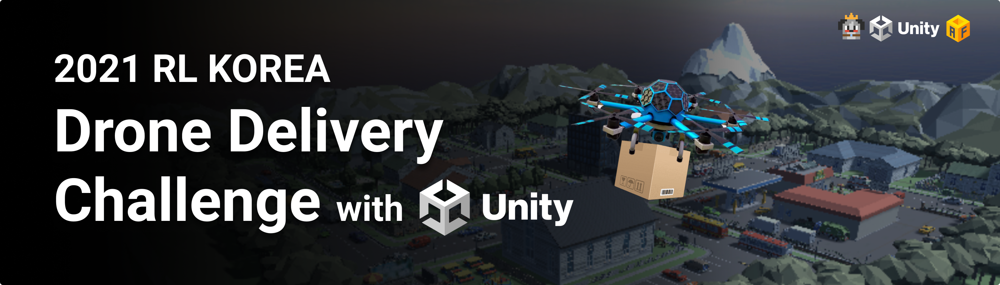
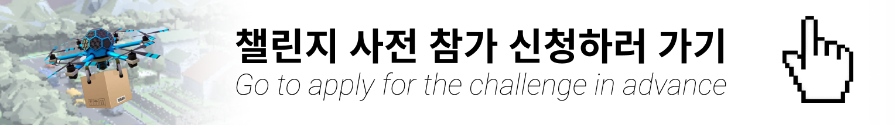
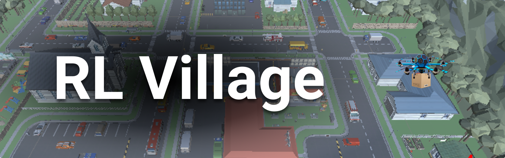
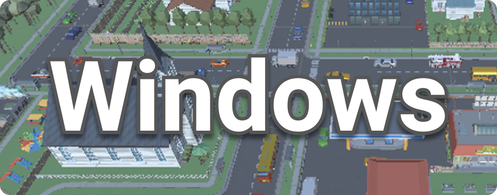
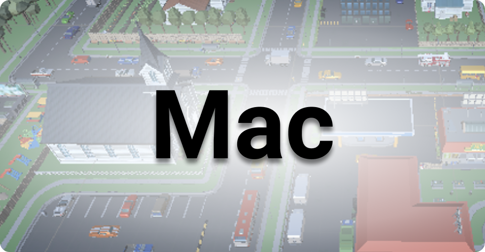
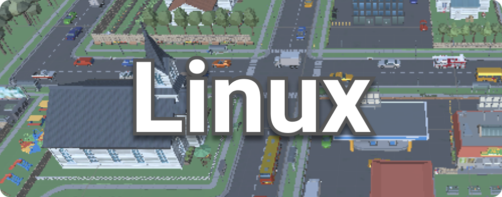
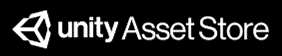
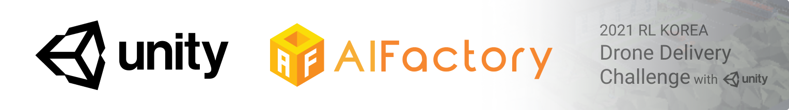

<p align= "center">
  
</p>

## ⏰ NOW

지금은 사전 신청 기간 `2021.09.27-2021.10.15` 입니다. 아래 사전 신청서 링크로 들어가서 작성해주세요!

[](https://unitysoftware.co1.qualtrics.com/jfe/form/SV_3ruLbftc809bXoy)


## Welcome!👋

본 챌린지는 RL Korea에서 주최하는 2021 RL Korea Drone Delivery Challenge with Unity 입니다. 

본 챌린지는 강화학습 알고리즘으로 드론이 물류창고의 물품들을 배송지인 집으로 빠르고 안전하게 배송하도록 학습시키는 것이 목표입니다. 

다양한 강화학습 알고리즘들을 한번 시도해보고, 혹시 강화학습이 처음이시더라도 이번 챌린지에서 도전해보시면서 강화학습의 매력을 경험해 볼 수 있는 좋은 기회가 되시길 바랍니다. 

### 🔥 Who will be the coolest drone delivery model?

---
## ➡️ Index

> Click to get to the section you want quickly.

**|** [Schedule](https://github.com/reinforcement-learning-kr/rlkorea_drone_challenge#-schedule) **|** [Awards](https://github.com/reinforcement-learning-kr/rlkorea_drone_challenge#-awards) **|** [Join the challenge](https://github.com/reinforcement-learning-kr/rlkorea_drone_challenge#-join-the-challenge) **|** [About RL Village](https://github.com/reinforcement-learning-kr/rlkorea_drone_challenge#-about-rl-village) **|** [Let's START](https://github.com/reinforcement-learning-kr/rlkorea_drone_challenge#-lets-start) **|** [Operator(Contact)](https://github.com/reinforcement-learning-kr/rlkorea_drone_challenge#-operatorcontact) **|** [Sponsor](https://github.com/reinforcement-learning-kr/rlkorea_drone_challenge#-sponsor)


## 📅 Schedule
|Date|Event|
|-|-|
|**2021.11.01**|챌린지 시작 START|
|**2021.11.30**|챌린지 종료 END|


## 🏆 Awards
2021 RLKorea Drone Delivery Challenge의 어워드는 다음과 같습니다.🎉

|Grade|Award|
|-|-:|
|🥇1st|200만원|
|🥈2nd|100만원|
|🥉3rd|50만원|
|🎖Unity 특별상|50만원|
- 1st, 2nd, 3rd Award는 Submission 채점 기준에 따라 리더보드에서 결정됩니다.
- Unity 특별상은 순위권 제외한 팀들 중 Python API가 아닌 **ml-agents 2.0 내부 알고리즘(PPO, SAC)** 을 이용하여 최고 성적을 낸 팀에게 수여됩니다.
  - 참여 방법에 대한 안내 [🚀Let's START](https://github.com/reinforcement-learning-kr/2021_RLKR_Drone_Delivery_Challenge_with_Unity#-lets-start)를 참고해주세요.
  - 리더보드의 순위와 별개로 시상하는 상이므로, 1st, 2nd, 3rd 상금과 중복 수령 가능합니다.

---
## 👩‍💻 Join the challenge 👨‍💻

대회에 참가하기 위해서는 아래의 **참가 신청서**을 작성해주시면 됩니다.

> TBA

☑️ [참가 신청서 작성하기]()

대회 기간 동안 소통의 장은 RL Korea Slack의 `#2021 RLKorea Drone Delivery Challenge` 채널을 이용하실 수 있습니다.

> TBA

➡️ [Slack #2021 RLKorea Drone Delivery Challenge 채널 들어가기]()

아직 Reinforcement Learning Korea Slack에 가입하지 않으셨다면, [여기](https://join.slack.com/t/rlkorea/shared_invite/zt-6k0rmvv5-N0~l19xAKuXMK~WpcdwYzQ)를 눌러주세요!

---
## 🏡 About RL Village

<p align= "center">
  
</p>

```
RL Village는 이번 챌린지에서 드론 Agent가 배송을 할 아름다운 마을입니다. 

RL Village에는 드론이 얻어야할 많은 정보들이 있습니다. 

이 정보들을 잘 활용하여 Reinforcement Learning Agent를 만들어보세요! 

RL Village에 대한 자세한 정보는 아래의 링크에서 보실 수 있습니다.
```

### ✔️ [RL Village 환경 관련 정보 살펴보기](https://github.com/reinforcement-learning-kr/rlkorea_drone_challenge/blob/master/docs/rl_village_info.md)

### 📥 RL Village 환경 Download
RL Village를 다운받으실 때는 참가자 여러분들의 OS에 맞는 파일을 다운받아주세요.
> TBA

{: width="150"}
{: width="150"}
{: width="150"}

### 📦 RL Village Unity Assets
RL Village를 구성하는 Unity Asset 리스트 입니다.


|No.|Assets|Link|
|---|---|---|
|1|drone|https://assetstore.unity.com/packages/tools/physics/free-pack-117641|
|2|village|https://assetstore.unity.com/packages/3d/environments/urban/polygon-town-pack-low-poly-3d-art-by-synty-121115|
|3|village|https://assetstore.unity.com/packages/3d/environments/urban/polygon-city-low-poly-3d-art-by-synty-95214|
|4|sky|https://assetstore.unity.com/packages/2d/textures-materials/sky/allsky-free-10-sky-skybox-set-146014|
|5|bird|https://assetstore.unity.com/packages/3d/characters/animals/birds/living-birds-15649|
|6|marker||


---
## 🚀 Let's START

2021 RL Korea Drone Delivery Challenge를 시작하기 위해서는 `2 가지` 방법으로 참여할 수 있습니다. 

Python으로 직접 작성한 RL 알고리즘으로 참여하고 싶으신 분은 1️⃣을, 

unity ml-agents 2.0에서 제공하는 알고리즘으로 참여하고 싶으신 분은 2️⃣를 참고해주세요. 

모든 참가자 분들에게 공통된 사항은 ⏺으로 안내하겠습니다.

||참가방식|설명|
|:-:|:-:|-|
|1️⃣|python API|자신이 직접 python으로 작성한 RL 알고리즘을 이용하는 참가자|
|2️⃣|ml-agents 2.0|Unity ml-agents 2.0에서 제공하는 PPO, SAC 알고리즘을 이용하는 참가자|
|⏺|ALL|모든 참가자에게 해당하는 공통사항|

- ⏺ [Unity ml-agents 설치하기](https://github.com/reinforcement-learning-kr/rlkorea_drone_challenge/blob/master/docs/unity_ml-agents_install.md)

- 1️⃣ [Python API를 사용하여 랜덤 에이전트로 실행하기](https://github.com/reinforcement-learning-kr/rlkorea_drone_challenge/blob/master/docs/run_with_random_agent.md)

- 1️⃣ [Python API를 사용하여 예제 알고리즘 (DQN, A2C)로 학습하기](https://github.com/reinforcement-learning-kr/rlkorea_drone_challenge/blob/master/docs/run_with_baseline_dqn_a2c.md)

- 2️⃣ [ml-agents 2.0에서 제공하는 알고리즘을 사용하여 학습하기](https://github.com/reinforcement-learning-kr/rlkorea_drone_challenge/blob/master/docs/run_with_ml-agents.md)

- ⏺ [Submission 모델 제출하기](https://github.com/reinforcement-learning-kr/rlkorea_drone_challenge/blob/master/docs/submission.md)

---
## 👥 Operator(Contact)

대회 기간동안 문의사항은 Slack에서 빠르게 답변드리도록 하겠습니다. 

이외에 Slack에서 문의하기 어려운 내용은 아래의 메일로 연락을 주시면 감사하겠습니다.

📧 Contact: rlkorea7@gmail.com

- 민규식, 이동민, 이정연, 이정우, 정규열, 차금강 


## 💙 Support

Thanks to

<p align= "center">
  
</p>
