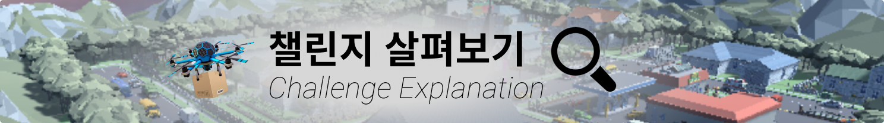
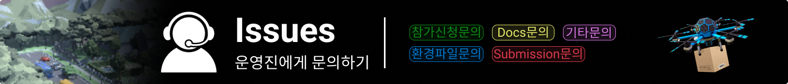
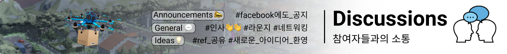

<p align= "center">
  
</p>

## Welcome!👋

본 챌린지는 RL Korea에서 주최하는 2021 RL Korea Drone Delivery Challenge with Unity 입니다. 

본 챌린지는 강화학습 알고리즘으로 드론이 물류창고의 물품들을 배송지인 집으로 빠르고 안전하게 배송하도록 학습시키는 것이 목표입니다. 

📍 자세한 대회 안내는 **Challenge Explanation**에서 확인해보세요! 

[](https://github.com/reinforcement-learning-kr/2021_RLKR_Drone_Delivery_Challenge_with_Unity/blob/master/docs/explanation.md)

> [대회 시나리오](https://github.com/reinforcement-learning-kr/2021_RLKR_Drone_Delivery_Challenge_with_Unity/blob/master/docs/explanation.md#senario)와 [모델 평가 기준(Evaluation)](https://github.com/reinforcement-learning-kr/2021_RLKR_Drone_Delivery_Challenge_with_Unity/blob/master/docs/explanation.md#evaluation)을 확인하실 수 있습니다.

다양한 강화학습 알고리즘들을 한번 시도해보고, 혹시 강화학습이 처음이시더라도 이번 챌린지에서 도전해보시면서 강화학습의 매력을 경험해 볼 수 있는 좋은 기회가 되시길 바랍니다.

### 🔥 Who will be the coolest drone delivery model?

[](http://aifactory.space/competition/leaderboard/1893)

---
## ➡️ Index

> Click to get to the section you want quickly.

**|** [Schedule](https://github.com/reinforcement-learning-kr/2021_RLKR_Drone_Delivery_Challenge_with_Unity#-schedule) **|** [Awards](https://github.com/reinforcement-learning-kr/2021_RLKR_Drone_Delivery_Challenge_with_Unity#-awards) **|** [Enjoy the Challenge](https://github.com/reinforcement-learning-kr/2021_RLKR_Drone_Delivery_Challenge_with_Unity#-enjoy-the-challenge-) **|** [Challenge Environment](https://github.com/reinforcement-learning-kr/2021_RLKR_Drone_Delivery_Challenge_with_Unity#-challenge-environment) **|** [Let's START](https://github.com/reinforcement-learning-kr/2021_RLKR_Drone_Delivery_Challenge_with_Unity#-lets-start) **|** [Operator(Contact)](https://github.com/reinforcement-learning-kr/2021_RLKR_Drone_Delivery_Challenge_with_Unity#-operatorcontact) **|** [Support](https://github.com/reinforcement-learning-kr/2021_RLKR_Drone_Delivery_Challenge_with_Unity#-support)


## 📅 Schedule
|Date|Event|
|-|-|
|**2021.11.01**|챌린지 시작 START|
|**2021.11.30**|챌린지 종료 END|


## 🏆 Awards
2021 RL Korea Drone Delivery Challenge with Unity의 어워드는 다음과 같습니다.🎉

|Rank|Award|수령 팀 수|
|:-:|-:|:-:|
|🥇1st|200만원|1|
|🥈2nd|100만원|1|
|🎖Unity 특별상|50만원|2|

- 1st, 2nd Award는 Submission 채점 기준에 따라 리더보드에서 결정됩니다.
- Unity 특별상은 Python API가 아닌 **ml-agents 2.0 내부 알고리즘(PPO, SAC)** 을 이용하여 최고 성적을 낸 2팀에게 수여됩니다.
  - 참여 방법에 대한 안내 [🚀Let's START](https://github.com/reinforcement-learning-kr/2021_RLKR_Drone_Delivery_Challenge_with_Unity#-lets-start)를 참고해주세요.
  - 리더보드의 순위와 **별개로** 시상하는 상이므로, 1st, 2nd 상금과 **중복 수령 가능** 합니다.

---
## 👩‍💻 Enjoy the Challenge! 👨‍💻

챌린지를 더욱 더 재밌고 효율적으로 즐기기 위한 방법들을 소개합니다. 대회 기간동안 적극적으로 활용해주세요!

> 이전에 안내해드린 Slack 채널로는 운영하지 **않고** Github으로 통합할 예정입니다.

### FAQ

**챌린지에 관해 자주 나오는 질의응답은 [FAQ](https://github.com/reinforcement-learning-kr/2021_RLKR_Drone_Delivery_Challenge_with_Unity/discussions/2)에 정리되어 있으니 한번 확인해보세요!**

### Issues

[](https://github.com/reinforcement-learning-kr/2021_RLKR_Drone_Delivery_Challenge_with_Unity/issues)

```
아래 각 이슈에 대한 설명을 읽어보시고 해당하는 Issue Template를 활용하여 문의사항을 적어주세요. 

최대한 빠른 시간안에 답변드릴 수 있도록 노력하겠습니다!
```

- `참가신청문의` : 챌린지 참가 신청에 관한 이슈와 문의
- `환경파일문의` : 챌린지 환경파일인 RL Village에 관한 이슈와 문의
- `Docs문의` : 챌린지 Github에 올라와 있는 [docs]()에 관한 이슈와 문의
- `Submission문의` : 모델 제출, 리더보드에 관한 이슈와 문의
- `기타문의` : 위 카테고리에 해당되지 않은 운영진에게 전달하고 싶은 이슈와 문의

### Discussions

[](https://github.com/reinforcement-learning-kr/2021_RLKR_Drone_Delivery_Challenge_with_Unity/discussions)

챌린지 기간 동안에 참여자분들을 위한 Communication 공간 입니다.

- `Announcements` : 대회 기간에 중요한 일정이나 공지를 운영진측에서 올릴 때 쓰는 카테고리 입니다. 챌린지 **[FAQ](https://github.com/reinforcement-learning-kr/2021_RLKR_Drone_Delivery_Challenge_with_Unity/discussions/2)** 를 확인해보세요.
- `General` : 대회에 참가한 모든 분들과 인사를 나눠주세요! 네트워킹도 편하게 즐겨주시는 라운지같은 공간입니다.
- `Ideas` : 재밌는 생각이나 신기한 참고 레퍼런스를 공유하고 싶으신가요? 여기를 이용해주세요!

---
## 🏡 Challenge Environment

본 챌린지에서 사용하는 환경은 **RL Village** 입니다. 

Unity Engine을 사용하여 제작되었으며 아래 링크에서 자세한 정보를 보실 수 있습니다.

### ✔️ [RL Village 환경 관련 정보 살펴보기](https://github.com/reinforcement-learning-kr/rlkorea_drone_challenge/blob/master/docs/rl_village_info.md)

### [11월 1일 공개] 📥 RL Village 환경 Download

> RL Village를 다운받으실 때는 참가자 여러분들의 OS에 맞는 파일을 다운받아주세요. **리눅스 서버 버젼의 환경파일은 제공하지 않습니다.**

[]()
[]()
[]()


---
## 🚀 Let's START

2021 RL Korea Drone Delivery Challenge를 시작하기 위해서는 `2 가지` 방법으로 참여할 수 있습니다. 

Python으로 직접 작성한 RL 알고리즘으로 참여하고 싶으신 분은 1️⃣을, 

unity ml-agents 2.0에서 제공하는 알고리즘으로 참여하고 싶으신 분은 2️⃣를 참고해주세요. 

모든 참가자 분들에게 공통된 사항은 ⏺으로 안내하겠습니다.

||참가방식|설명|
|:-:|:-:|-|
|1️⃣|python API|자신이 직접 python으로 작성한 RL 알고리즘을 이용하는 참가자|
|2️⃣|ml-agents 2.0|Unity ml-agents 2.0에서 제공하는 PPO, SAC 알고리즘을 이용하는 참가자|
|⏺|ALL|모든 참가자에게 해당하는 공통사항|

- ⏺ [Unity ml-agents 설치하기](https://github.com/reinforcement-learning-kr/2021_RLKR_Drone_Delivery_Challenge_with_Unity/blob/master/docs/unity_ml-agents_install.md)

- 1️⃣ [Python API를 사용하여 랜덤 에이전트로 실행하기](https://github.com/reinforcement-learning-kr/2021_RLKR_Drone_Delivery_Challenge_with_Unity/blob/master/docs/run_with_random_agent.md)

- 1️⃣ [Python API를 사용하여 예제 알고리즘 (DQN, A2C)로 학습하기](https://github.com/reinforcement-learning-kr/2021_RLKR_Drone_Delivery_Challenge_with_Unity/blob/master/docs/run_with_baseline_dqn_a2c.md)

- 2️⃣ [ml-agents 2.0에서 제공하는 알고리즘을 사용하여 학습하기](https://github.com/reinforcement-learning-kr/2021_RLKR_Drone_Delivery_Challenge_with_Unity/blob/master/docs/run_with_ml-agents.md)

- ⏺ [학습된 모델 제출하기](https://github.com/reinforcement-learning-kr/2021_RLKR_Drone_Delivery_Challenge_with_Unity/blob/master/docs/submission.md)

---
## 👥 Operator(Contact)

**대회 기간동안** 문의사항은 [Issues](https://github.com/reinforcement-learning-kr/2021_RLKR_Drone_Delivery_Challenge_with_Unity#issues) 안내를 참고하셔서 글을 써주시면 최대한 빠르게 답변드리도록 하겠습니다. 많은 분들이 궁금해하실 문의에 대해서는 챌린지 **[FAQ](https://github.com/reinforcement-learning-kr/2021_RLKR_Drone_Delivery_Challenge_with_Unity/discussions/2)** 에 정리해놓았습니다. 문의 전에 한번 확인해보시길 권장해드립니다. 

이외에 대회 문의는 아래의 메일로 연락을 주시면 최대한 빠르게 답변해드리겠습니다.

📧 Contact: rlkorea7@gmail.com

- 민규식, 이동민, 이정연, 이정우, 정규열, 차금강 


## 💙 Support

Thanks to

<p align= "center">
  
</p>
