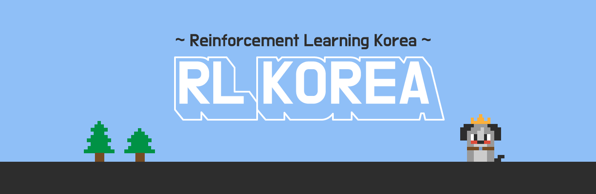
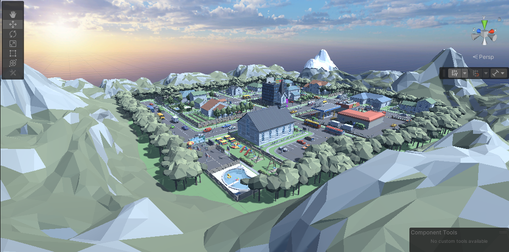

  

# 2021 RLKorea Drone Delivery Challenge 

## :fire: Welcome!

본 챌린지는 RLKorea에서 주최하는 Drone Delivery Challenge입니다. 본 챌린지는 강화학습 알고리즘으로 드론이 물류창고의 물품들을 배송지인 집으로 빠르고 안전하게 배송하도록 학습시키는 것이 목표입니다. 다양한 강화학습 알고리즘들을 한번 시도해보고, 혹시 강화학습이 처음이시더라고 챌린지의 playground에서 도전해보며 강화학습의 매력을 경험해 볼 수 있는 좋은 기회가 되시길 바랍니다. 🤗 
> Who will be the coolest drone delivery model?

## Index
Click to get to the section you want quickly.
- [About RL Village](https://github.com/reinforcement-learning-kr/rlkorea_drone_challenge#package-%EB%93%9C%EB%A1%A0-%EB%B0%B0%EC%86%A1-%ED%99%98%EA%B2%BD-rl-village)
- [How to start](https://github.com/reinforcement-learning-kr/rlkorea_drone_challenge#rocket-%EC%B1%8C%EB%A6%B0%EC%A7%80-%EC%8B%9C%EC%9E%91%ED%95%98%EA%B8%B0)
- [Schedule](https://github.com/reinforcement-learning-kr/rlkorea_drone_challenge#calendar-%EC%9D%BC%EC%A0%95)
- [Awards](https://github.com/reinforcement-learning-kr/rlkorea_drone_challenge#trophy-awards)
- [How to participate](https://github.com/reinforcement-learning-kr/rlkorea_drone_challenge#how-to-participate)
- [운영진(문의처)](https://github.com/reinforcement-learning-kr/rlkorea_drone_challenge#busts_in_silhouette-%EC%9A%B4%EC%98%81%EC%A7%84)
- [Sponsor](https://github.com/reinforcement-learning-kr/rlkorea_drone_challenge#thumbsup-%ED%9B%84%EC%9B%90)

## :package: RL Village 드론 배송 환경

  

RL Village는 이번 챌린지에서 드론 Agent가 배송을 할 아름다운 마을입니다. RL 알고리즘만 허용되는 신기한 RL Village에는 드론이 얻어야할 많은 정보들이 있습니다. 이 정보들을 잘 활용하여 스마트한 RL 알고리즘을 만들어봅시다. RL Village에 대한 자세한 정보는 아래의 링크에서 보실 수 있습니다.

👉 [환경 관련 정보](https://github.com/reinforcement-learning-kr/rlkorea_drone_challenge/rl_village_info.md)

#### RL Village 환경 다운로드 링크
RL Village를 다운받으실 때는 참가자 여러분들의 OS에 맞는 파일을 다운받아주세요.

- WIndows: [Link](https://www.dropbox.com/s/rjx6k6jcehhds46/windows.zip?dl=0) 
- Mac: [Link](https://www.dropbox.com/s/hv8uwax87in82wh/mac.zip?dl=0)
- Linux: [Link](https://www.dropbox.com/s/4j1cnkft5sdn9gc/Linux.zip?dl=0)

#### RL Village 사용 에셋
RL Village에서 사용한 에셋 리스트 입니다.

|Num|Assets|Link|
|---|---|---|
|1|드론 에셋|https://assetstore.unity.com/packages/tools/physics/free-pack-117641|
|2|마을 에셋|https://assetstore.unity.com/packages/3d/environments/urban/polygon-town-pack-low-poly-3d-art-by-synty-121115|
|3|마을 에셋|https://assetstore.unity.com/packages/3d/environments/urban/polygon-city-low-poly-3d-art-by-synty-95214|
|4|하늘 에셋|https://assetstore.unity.com/packages/2d/textures-materials/sky/allsky-free-10-sky-skybox-set-146014|
|5|새 에셋|https://assetstore.unity.com/packages/3d/characters/animals/birds/living-birds-15649|

## :rocket: 챌린지 시작하기  
2021 RLKorea Drone Delivery Challenge를 시작하기 위해서는 2가지 방법으로 참여할 수 있습니다.

1. python api
2. ml-agents

(common)

- [Unity ML-Agents 설치하기](https://github.com/reinforcement-learning-kr/rlkorea_drone_challenge/unity_ml-agents_install.md)

(type1.python api)

- [환경 다운로드 후 랜덤 에이전트로 실행하기](https://github.com/reinforcement-learning-kr/rlkorea_drone_challenge/run_with_random_agent.md)

- [예제 알고리즘 (DQN, A2C)로 환경 학습하기](https://github.com/reinforcement-learning-kr/rlkorea_drone_challenge/run_with_baseline_dqn_a2c.md)

(type2.ml-agents)

- [ML-Agents에서 제공하는 알고리즘을 사용하여 환경 학습하기](https://github.com/reinforcement-learning-kr/rlkorea_drone_challenge/run_with_ml-agents.md)

## :calendar: 일정 
### **Milestone(주요일정)**
- **2021.xx.xx**: 챌린지 시작 

- **2021.xx.xx**: 챌린지 종료 

### **Time table(세부일정)**

Day1 Orientation and Preparation

|Mon(Aug 30)||
|-|-|
|10:00|대회 오픈|
|11:00-14:00|대회 오픈|
||대회 오픈|
||대회 오픈|

Day2 Hackaton

|Tue(Aug 31)||
|-|-|
||대회 오픈|
||대회 오픈|
||대회 오픈|
||대회 오픈|

Day3 Final/Awards

|Wed(Sep 1)||
|-|-|
||대회 오픈|
||대회 오픈|
||대회 오픈|
||수상자 발표|

## :trophy: Awards
2021 RLKorea Drone Delivery Challenge의 어워드는 다음과 같습니다.🎉

|Grade|Award|
|-|-|
|1st||
|2nd||
|3rd||

## How to participate
대회에 참가하기 위해서는 아래의 참가 신청 양식을 작성해주시면 됩니다.

👉[참가 양식 작성하기]()

대회 기간 동안 소통의 장은 RL Korea Slack의 `#2021 RLKorea Drone Delivery Challeng` 채널을 이용하실 수 있습니다.

👉[Slack #2021 RLKorea Drone Delivery Challeng 채널 들어가기]()

## :busts_in_silhouette: 운영진 

대회 기간동안 생기는 문제들 문의사항은 Slack에서 빠르게 답변드리도록 하겠습니다. 이외에 Slack에서 문의하기 어려운 내용은 아래의 메일로 연락을 주시면 감사하겠습니다.

:e-mail: 문의 메일: 

- 민규식, 이동민, 이정연, 이정우, 정규열, 차금강 

## :thumbsup: 후원 
Thanks to

  

