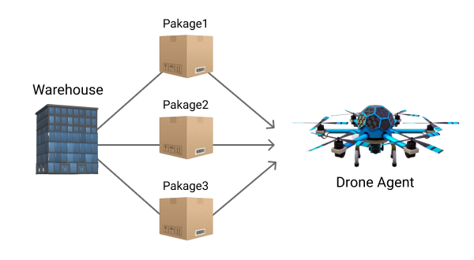
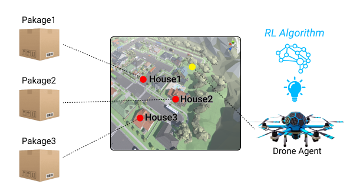
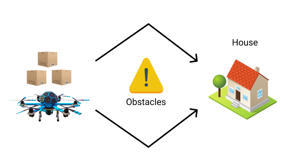
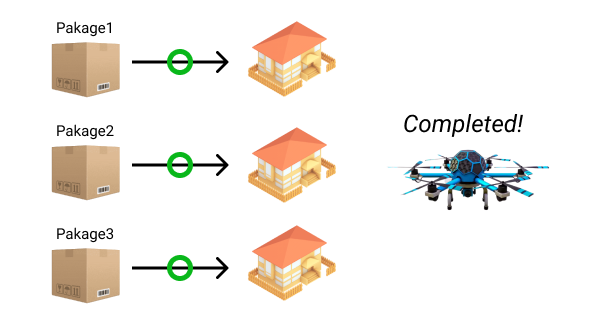
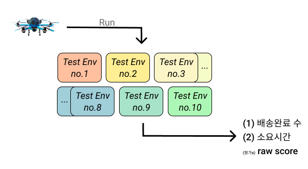

#### ➡️ Index
- [Goal](https://github.com/reinforcement-learning-kr/2021_RLKR_Drone_Delivery_Challenge_with_Unity/blob/master/docs/explanation.md#goal)
- [Senario](https://github.com/reinforcement-learning-kr/2021_RLKR_Drone_Delivery_Challenge_with_Unity/blob/master/docs/explanation.md#senario)
- [Evaluation](https://github.com/reinforcement-learning-kr/2021_RLKR_Drone_Delivery_Challenge_with_Unity/blob/master/docs/explanation.md#evaluation)
    - [⭐️ 평가 항목 우선순위](https://github.com/reinforcement-learning-kr/2021_RLKR_Drone_Delivery_Challenge_with_Unity/blob/master/docs/explanation.md#%EF%B8%8F-%ED%8F%89%EA%B0%80-%ED%95%AD%EB%AA%A9-%EC%9A%B0%EC%84%A0%EC%88%9C%EC%9C%84)
    - [Test Environment](https://github.com/reinforcement-learning-kr/2021_RLKR_Drone_Delivery_Challenge_with_Unity/blob/master/docs/explanation.md#test-environment)
    - [Submission](https://github.com/reinforcement-learning-kr/2021_RLKR_Drone_Delivery_Challenge_with_Unity/blob/master/docs/explanation.md#submission)
---

# Challenge Explanation

## Goal

본 챌린지에서는 강화학습 알고리즘으로 드론이 물류창고의 물품들을 집으로 빠르고 안전하게 배송하도록 학습시키는 것이 목표입니다.

## Senario

1. 에피소드가 시작되면 Drone이 물류창고(Warehouse)에서 해당 Episode에서 배송할 3개 Package들을 **모두** 싣게 됩니다.



2. 각 Package는 배달 될 House가 있고 이는 [10개 집들](https://github.com/curieuxjy/2021_RLKR_Drone_Delivery_Challenge_with_Unity/blob/master/docs/rl_village_info.md#-rl-village-%EC%86%8C%EA%B0%9C-%EB%B0%8F-%EA%B5%AC%EC%84%B1) 중 랜덤으로 3개가 선정됩니다. 따라서 총 3개의 집으로 Drone Agent가 도착해야 합니다. 



3. RL Village에 있는 모든 장애물(새, 건물 등)을 State 정보를 활용하여 파악하며 선회하여 주행할 수 있어야 합니다.



4. 모든 3개의 집들에 배달을 완료하면 에피소드 Mission Completed! 입니다.



---

## Evaluation

Submission된 모델들을 평가하는 방식에 대해서 설명합니다. 

평가방식은 평가항목별 우선순위가 존재하며 우선순위부터 비교하며 순위가 정해집니다.

### ⭐️ 평가 항목 우선순위
1. `배달 완료 수`: 10개의 Test Environment에서 배달완료 된 총합(모든 배달을 완료했을 경우, 30 = 10X3)
2. `소요 시간`: 10개의 Test Environment 각각에서 측정된 time1,time2,time3의 평균(30개의 time 평균)

위의 `배달 완료 수`와 `소요 시간`을 기반으로 순위가 매겨지며, `배달 완료 수`를 우선으로 등수가 매겨지고 같은 `배달 완료 수`일 경우, `소요 시간`을 기반으로 순위가 매겨집니다.

### Test Environment

배달할 집들이 **서로 다른** 10개의 Test Environment가 되며 각 Test Environment에서 모델은 1번만 inferening 됩니다. 예시 Test Environment의 예시는 다음과 같습니다.

```
- Test Environment no.1 : 1,3,4 집 배달
- Test Environment no.2 : 3,7,8 집 배달
- ...
- Test Environment no.10 : 3,6,9 집 배달
```



각 Test Environment 10개에서 모델은 1번씩만 inferencing을 실행하게 되며, 모델이 평가된 후 산출 되는 값은 다음과 같습니다.

- `배달 완료수`: 각 Test Environment 1개에는 배송지 3개가 있으며 Agent가 배달한 총 배달 완료수 입니다. 10개의 inferening 결과에서 배달 완료한 모든 수의 **총합(Sum)** 입니다. 

- `소요 시간`: 한 Test Environment에서 배달을 수행하면서 소요시간을 총 3번 측정하게 됩니다. 창고-배달지1(`time1`), 배달지1-배달지2(`time2`), 배달지2-배달지3(`time3`)로 총 3개의 time이 한번의 inferening 과정에서 측정되며 time1,2,3의 **평균값(Mean)** 이 해당 inferening에서 측정된 소요시간으로 기록됩니다.

> 배달지 3개에 대한 넘버링은 환경에서 주어지는 것이 아닙니다. 배달지1, 배달지2, 배달지3의 넘버링은 배달완료 수순으로 결정됩니다.


- `raw score`: Unity로 빌드된 RL Village에서 출력되는 누적 스코어이며 평가에 사용되는 항목은 **아닙니다.** 
> 더 나은 모델 연구를 위한 참고용으로만 사용해주세요.

### Submission

챌린지 모델 제출은 11월 10일부터 가능하며, 자세한 제출 방법과 점수 확인 방법은 [Submission.md](https://github.com/reinforcement-learning-kr/2021_RLKR_Drone_Delivery_Challenge_with_Unity/blob/master/docs/submission.md)에서 확인해주세요.
