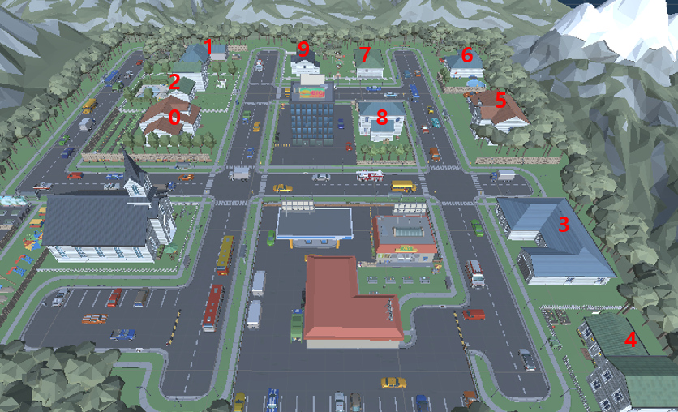
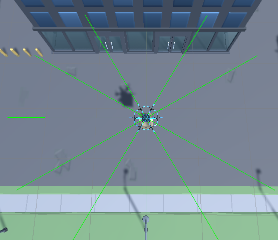
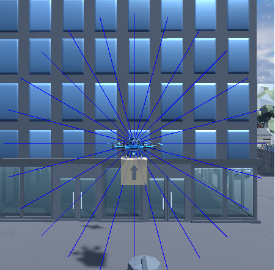
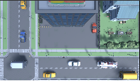

#### ➡️ Index
- [RL Village 소개 및 구성]()
- [State](https://github.com/reinforcement-learning-kr/2021_RLKR_Drone_Delivery_Challenge_with_Unity/blob/master/docs/rl_village_info.md#state)
    - [Vector Observation](https://github.com/reinforcement-learning-kr/2021_RLKR_Drone_Delivery_Challenge_with_Unity/blob/master/docs/rl_village_info.md#vector-observation)
    - [Visual Observation](https://github.com/reinforcement-learning-kr/2021_RLKR_Drone_Delivery_Challenge_with_Unity/blob/master/docs/rl_village_info.md#visual-observation)
    - [Raycast](https://github.com/reinforcement-learning-kr/2021_RLKR_Drone_Delivery_Challenge_with_Unity/blob/master/docs/rl_village_info.md#raycast)
- [Action](https://github.com/reinforcement-learning-kr/2021_RLKR_Drone_Delivery_Challenge_with_Unity/blob/master/docs/rl_village_info.md#action)
- [Reward](https://github.com/reinforcement-learning-kr/2021_RLKR_Drone_Delivery_Challenge_with_Unity/blob/master/docs/rl_village_info.md#reward)
    - [Event Reward](https://github.com/reinforcement-learning-kr/2021_RLKR_Drone_Delivery_Challenge_with_Unity/blob/master/docs/rl_village_info.md#event-reward)
    - [Distance Reward](https://github.com/reinforcement-learning-kr/2021_RLKR_Drone_Delivery_Challenge_with_Unity/blob/master/docs/rl_village_info.md#distance-reward)
- [Done](https://github.com/reinforcement-learning-kr/2021_RLKR_Drone_Delivery_Challenge_with_Unity/blob/master/docs/rl_village_info.md#done)
- [Customization]()
- [RL Village Unity Assets]()

---
## 🏡 RL Village 소개 및 구성

<p align= "center">
  
</p>

```
RL Village는 이번 챌린지에서 드론 Agent가 배송을 할 아름다운 마을입니다. 

RL Village에는 드론이 미션을 수행하기 위해 얻어야할 많은 정보들이 있습니다. 

이 정보들을 잘 활용하여 Reinforcement Learning Agent를 만들어보세요! 

```

- 드론 에이전트가 배송할 집들이 10개가 있으며, 한 에피소드에서 10개의 집들 중 **3개**가 랜덤으로 지정됩니다.
- 3개의 집들은 에피소드 초기화시 새롭게 지정됩니다.
- 마을에는 정적 장애물들과 동적 장애물들이 있습니다.
    - 정적 장애물 : 건물, 나무, 차량 등
    - 동적 장애물 : 새



---

챌린지의 환경인 RL Village MDP에 대해 소개합니다. 

## State

### Vector Observation 

- Size: 95

|info|description|size|
|-|-|-|
|배송할 집의 택배 배달 위치의 좌표|(x, y, z), (x, y, z), (x, y, z)|9|
|agent의 좌표|(x, y, z)|3|
|agent의 velocity|(x, y, z)|3|
|agent의 angularVelocity|(x, y, z)|3|
|진행률 (%)|0~100|1|
|수평방향 Raycast|30도씩 12 방향, 각 방향 마다 2개씩 정보 - (1)탐지 여부 (2)탐지 위치와의 거리|24|
|수직방향 Raycast|15도씩 24 방향, 각 방향 마다 2개씩 정보 - (1)탐지 여부 (2)탐지 위치와의 거리|48|
|위 아래 Raycast|위 아래 방향, (1)탐지 여부 (2)탐지 위치와의 거리|4|

- **Horizontal ray**

<p align= "left">
  
</p>

- **Vertival ray**

<p align= "left">
  
</p>

- **Top and Bottom ray**

<p align= "left">
  
</p>
    

    
### Visual Observation


|Camera|Size(pixel)|Image|
|-|:-:|:-:|
|정면 카메라|(64, 36, 3)||
|우측 카메라|(64, 36, 3)||
|후면 카메라|(64, 36, 3)||
|좌측 카메라|(64, 36, 3)||
|하방 카메라|(64, 36, 3)||
    
    
### State 정리
- dec.obs[0] : 전방 카메라 (36, 64, 3)
- dec.obs[1] : 우측 카메라 (36, 64, 3)
- dec.obs[2] : 후방 카메라 (36, 64, 3)
- dec.obs[3] : 좌측 카메라 (36, 64, 3)
- dec.obs[4] : 하방 카메라 (36, 64, 3)
- dec.obs[5] : VectorObservation(39)

---

## Action

<p align= "left">
  
</p>
    
- x 방향 이동 (앞, 뒤) : -1 ~ 1 사이의 연속적인 값
- z 방향 이동 (좌, 우) : -1 ~ 1 사이의 연속적인 값
- y 방향 이동 (위, 아래) : -1 ~ 1 사이의 연속적인 값

---

## Reward

### Event reward 
- `+ 100`
    - 창고 위치에 도달했을때
    - 물품 배송이 완료 되었을때
- `- 100`
    - 건물 혹은 장애물(ex, 새, 자동차, 가로등, 지면등)에 부딪혔을 때
    - 맵 밖으로 멀리 이동 했을때

### Distance Reward

- 목표 지점과 거리에 따른 보상
    - `현재 Step에서 목표지점과 거리(curDistance) - 이전 Step에서 목표지점과 거리(preDistance)`


<p align= "left">
  
</p>
    
---
## Done

- 건물 혹은 장애물(ex, 새, 자동차, 가로등, 지면등)에 부딪혔을 때
- 맵 밖으로 멀리 이동 했을때
- 배송 물품을 모두 배달 완료 되었을때

## Customization

아래 경로에 있는 Parameters.json을 이용하여 환경의 요소들을 수정할 수 있습니다.

- **Windows :**   DroneDelivery_Data\StreamingAsset

- **Mac :**  Contents\Resources\Data\StreamingAssets

- **Linux :**  drone_Data\StreamingAssets

```
 {
 	"basicMaxStep" : 200,
	"easyMaxStep" : 200,
	"normalMaxStep" : 500,
	"hardMaxStep" : 1000,
	"reward" : 100,
	"penalty" : -100,
	"horiRayCount" : 12,
	"horiRayDis" : 2,
	"bottomRayDis": 0.4,
	"dropOffDistance": 1,
	"wareHouseDistance" : 1.5,
	"movableRange": 40,
	"defaultObsSize" : 10,
	"topRayDis": 0.4,
	"verticalRayCount" : 24,
	"verticalRayDis" : 2,
}
```

## 📦 RL Village Unity Assets
RL Village를 구성하는 Unity Asset 리스트 입니다.


|No.|Assets|Link|
|---|---|---|
|1|drone|https://assetstore.unity.com/packages/tools/physics/free-pack-117641|
|2|village|https://assetstore.unity.com/packages/3d/environments/urban/polygon-town-pack-low-poly-3d-art-by-synty-121115|
|3|village|https://assetstore.unity.com/packages/3d/environments/urban/polygon-city-low-poly-3d-art-by-synty-95214|
|4|sky|https://assetstore.unity.com/packages/2d/textures-materials/sky/allsky-free-10-sky-skybox-set-146014|
|5|bird|https://assetstore.unity.com/packages/3d/characters/animals/birds/living-birds-15649|
|6|marker||

