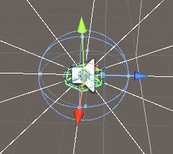
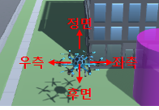
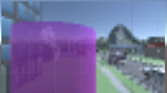
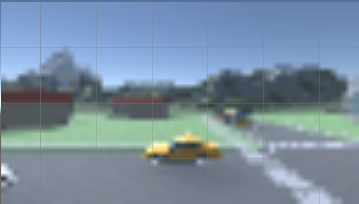
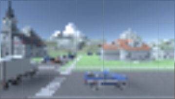
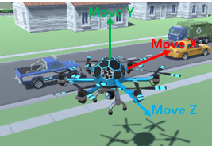
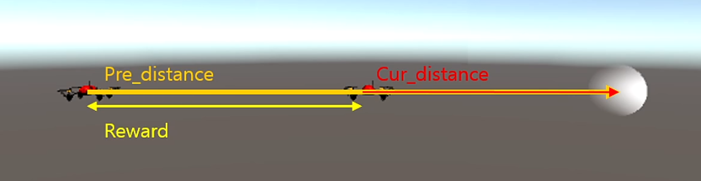

#### ➡️ Index
- [State](https://github.com/reinforcement-learning-kr/rlkorea_drone_challenge/blob/master/docs/rl_village_info.md#state)
    - [Vector Observation](https://github.com/reinforcement-learning-kr/rlkorea_drone_challenge/blob/master/docs/rl_village_info.md#vector-observation)
    - [Visual Observation](https://github.com/reinforcement-learning-kr/rlkorea_drone_challenge/blob/master/docs/rl_village_info.md#visual-observation)
    - [Raycast](https://github.com/reinforcement-learning-kr/rlkorea_drone_challenge/blob/master/docs/rl_village_info.md#raycast)
- [Action](https://github.com/reinforcement-learning-kr/rlkorea_drone_challenge/blob/master/docs/rl_village_info.md#action)
- [Reward](https://github.com/reinforcement-learning-kr/rlkorea_drone_challenge/blob/master/docs/rl_village_info.md#reward)
    - [Event Reward](https://github.com/reinforcement-learning-kr/rlkorea_drone_challenge/blob/master/docs/rl_village_info.md#event-reward)
    - [Distance Reward](https://github.com/reinforcement-learning-kr/rlkorea_drone_challenge/blob/master/docs/rl_village_info.md#distance-reward)
- [Done](https://github.com/reinforcement-learning-kr/rlkorea_drone_challenge/blob/master/docs/rl_village_info.md#done)

---

# RL Village Infomation
챌린지의 환경인 RL Village MDP에 대해 소개합니다. 

## State

### Vector Observation 

- Size: 39

|info|description|size|
|-|-|-|
|배송할 집의 택배 배달 위치의 좌표|(x, y, z)|3|
|agent의 좌표|(x, y, z)|3|
|agent의 velocity|(x, y, z)|3|
|agent의 angularVelocity|(x, y, z)|3|
|진행률 (%)|0~100|1|
|수평방향 Raycast|12|60도씩 6 방향, 각 방향 마다 2개씩 정보 - (1)탐지 여부 (2)탐지 위치와의 거리|
|수직방향 Raycast|2|아래 방향, (1)탐지 여부 (2)탐지 위치와의 거리|

  

    

    
### Visual Observation

|Camera|Size(pixel)|Image|
|-|:-:|:-:|
|정면 카메라|(64, 36, 3)||
|우측 카메라|(64, 36, 3)||
|후면 카메라|(64, 36, 3)||
|좌측 카메라|(64, 36, 3)||
    
    
### State 정리
- dec.obs[0] : 수평방향 RayCast(12)
- dec.obs[1] : 전방 카메라 (36, 64, 3)
- dec.obs[2] : 우측 카메라 (36, 64, 3)
- dec.obs[3] : 후방 카메라 (36, 64, 3)
- dec.obs[4] : 좌측 카메라 (36, 64, 3)
- dec.obs[5] : 하방 카메라 (36, 64, 3)
- dec.obs[6] : VectorObservation(13)
- dec.obs[7] : 아랫방향 RayCast(2)

---

## Action

  

    
- x 방향 이동 (앞, 뒤) : -1 ~ 1 사이의 연속적인 값
- z 방향 이동 (좌, 우) : -1 ~ 1 사이의 연속적인 값
- y 방향 이동 (위, 아래) : -1 ~ 1 사이의 연속적인 값

---

## Reward

### Event reward 
- `+ 100`
    - 창고 위치에 도달했을때
    - 물품 배송이 완료 되었을때
- `- 100`
    - 건물 혹은 장애물(ex, 새, 자동차, 가로등, 지면등)에 부딪혔을 때
    - 맵 밖으로 멀리 이동 했을때

### Distance Reward

- 목표 지점과 거리에 따른 보상
    - `현재 Step에서 목표지점과 거리(curDistance) - 이전 Step에서 목표지점과 거리(preDistance)`

  

    
---
## Done

- 건물 혹은 장애물(ex, 새, 자동차, 가로등, 지면등)에 부딪혔을 때
- 맵 밖으로 멀리 이동 했을때
- 배송 물품을 모두 배달 완료 되었을때

