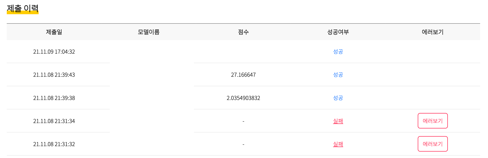

# Submission
- 2021 RLKorea Drone Delivery Challenge with Unity 제출을 위한 가이드입니다. 

- 제출을 위한 과정은 다음과 같습니다 

  1. AI Factory 가입 및 대회 참가 

  2. Key 요청 

  3. 제출 파일 작성 

  4. 파일 제출
  5. 실행 결과 확인
  6. 스코어 확인 

## 1. AI Factory 가입 및 대회 참가

- 먼저 [AI Factory의 2021 RL Korea Drone Delivery Challenge with Unity 페이지](http://aifactory.space/competition/detail/1893)로 이동해주세요
- AI Factory에 대한 가입 및 아래 그림과 같이 대회 참가를 진행해주세요! (아래 이미지의 **회원가입 후 대회 참가하기**를 꼭 눌러주세요!)

## 2. Key 요청 

#### 1) aifactory-beta 설치 

아래 명령어로 **aifactory-beta** 패키지를 설치합니다. (업데이트가 자주 발생할 수 있으므로 오류가 발생할 경우 업데이트를 시도해주세요!)

```
pip install aifactory-beta
# or
pip install aifactory-beta -u
```


#### 2) aifactory-request-key 명령어 실행 

아래 명령어를 실행해주세요! 

**Windows**

```
python -m aifactory.Executables.request_key
```

**Mac, Linux**

```
aifactory-request-key
```


#### 3) 이메일 주소 입력 

명령어를 입력하면 이메일 주소를 요구합니다. 인공지능 팩토리 플랫폼을 이용할 때 사용하시는 아이디를 입력해주세요. 해당 이메일 주소로 제출에 사용할 수 있는 키를 보내드립니다.

```
% aifactory-request-key
Please enter your user email: your-id@your-email-host.com
```


#### 4) 실행 결과 확인 

키를 요청하시면 키가 메일로 발송됩니다. 이메일을 받지 못하신 경우 'log/' 폴더에 생기는 로그를 확인해주시고 스팸함도 확인해주세요. 


## 3. 제출 파일 작성

참가자 분들의 경우 2가지 방법을 중 하나를 통해 챌린지에 참여해주셨을 것으로 생각합니다! 첫번째는 유니티 ML-Agents에서 제공하는 강화학습 알고리즘을 통해 학습하는 방식인 mlagents-learn을 이용한 학습, 두번째는 Python API를 통해 직접 파이썬으로 강화학습 코드를 구현하고 이를 통해 학습을 수행한 경우입니다. 각각의 경우에 따라 제출하는 파일의 구성에 차이가 있습니다. 

#### 1) mlagents-learn을 이용해 학습한 onnx 파일 제출 

mlagents-learn을 통해 학습을 수행하면 onnx 확장자를 가지는 파일이 생성됩니다. 이 경우에는 해당 파일만을 압축하고 제출하시면 됩니다. 본 문서에서는 이 파일을 `user_code.zip`이라는 압축 파일로 생성한 예시를 통해 설명을 진행하겠습니다. 

#### 2) Python API를 통해 학습한 모델 제출 

Python API를 사용하는 경우 

## 4. 파일 제출

아래 명령어와 옵션을 이용해 키와 파일을 전송하실 수 있습니다.

#### 1) 키를 직접 입력하는 경우 

이 경우는 --key와 --file 명령어를 이용하여 메일로 받은 키를 직접 입력하고 파일을 제출하는 방법입니다. 

**Windows**

```
python -m aifactory.Executables.submit --key 1234567somerandomekey7654321 --file user_code.zip
```

**Mac, Linux**

```
aifactory-submit --key 1234567somerandomekey7654321 --file user_code.zip
```

#### 2) 키 파일을 사용하는 경우 

이 경우는 --key-path와 --file 명령어를 이용하여 메일로 받은 키를 직접 입력하고 파일을 제출하는 방법입니다. 

해당 방법을 이용하는 경우 텍스트 파일을 만들어 가장 윗줄에 발급받은 키를 넣어놓고 사용할 수 있습니다. 

본 예시에서는 `mykey.afk` 라는 텍스트 파일을 만들어서 진행하겠습니다. 

**Windows**

```
python -m aifactory.Executables.submit --key-path my_key.afk --file user_code.zip
```

**Mac, Linux**

```
aifactory-submit --key-path my_key.afk --file user_code.zip
```


## 5. 실행 결과 확인

실행 결과는 'log/' 폴더에 생기는 로그를 확인해주세요. 

성공했을 경우에는 로그 파일에서 `API call was successful.` 메세지를 확인하실 수 있습니다.

- 제출 성공시에는 사용자분의 제출 기록을 위해 사용된 모델 이름과 총 몇 번 제출하셨는지 (인증 성공 후 제출 시도 횟수)가 기록되어 있습니다.

- 제출에는 횟수 제한이 있습니다
  - 시간 당 성공 회차 기준 5회 제출 가능
  - 실패한 시도 포함 시간 당 20회 제출 가능
  - 한 계정당 총 50 회 제출 가능
  - 제출한 파일은 2 회분만 저장

- 제출에 실패하셨을 경우에는 실패하셨을 때 생성된 로그를 첨부해서 대회 운영진에게 문의해주세요

## 6. 스코어 확인 

스코어는 AIFactory 페이지의 `제출하기` 에서 확인하실 수 있습니다.

결과물 채점이 실패했을 경우에는 에러메세지 확인하기 기능으로 오류내용을 확인하실 수 있습니다.

제출 횟수 제한은 채점 '성공'을 기준으로 합니다.


 `제출하기` 로 들어가면 다음의 예시와 같이 제출에 대한 성공 및 실패 여부를 확인할 수 있습니다. 




### 기타 사용 가능한 모든 옵션

```
aifactory-submit
  --key-path, -p  sample_data/my_key.afk
  --key, -k  1234567somerandomekey7654321
  --file, -f sample_data/answer.csv
  --log-dir ./log # 로그를 저장하는 디렉토리를 지정합니다.
  # --help, -h # 사용법을 확인합니다.
```


### 주의 사항

- 제출한 파일은 최대 2 개 까지 저장됩니다. 채점이 오래 걸리는 경우에 채점이 끝나기 전에 추가로 제출하시면 그 이전에 제출하신 결과물이 채점되지 않을 수 있습니다.
- 실행 명령어가 작동하지 않는 경우에는 `python -m aifactory.Executables.(request_key/submit)` 등과 같이 모듈을 직접 실행시키시면 됩니다.
