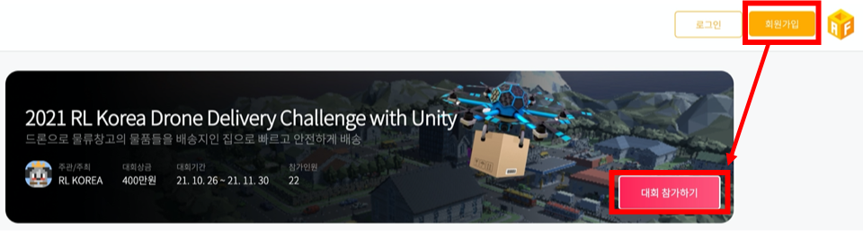
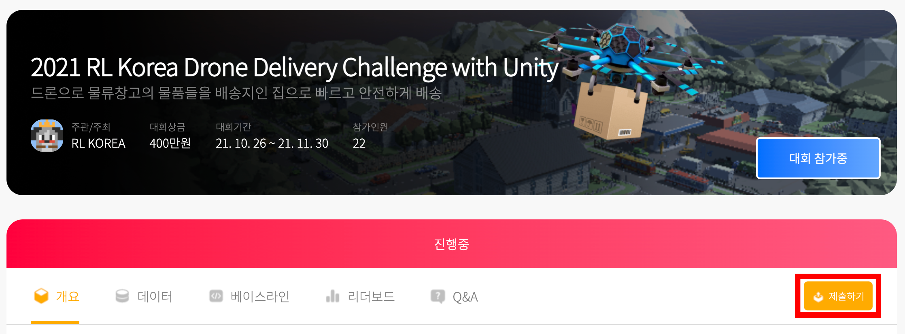

# Submission

:warning: 아직 제출 관련하여 불안정한 부분들이 있습니다! 제출시 생기는 문제 상황들은 Issue에 내용작성 해주시면 대응하겠습니다!  

- 2021 RLKorea Drone Delivery Challenge with Unity 제출을 위한 가이드입니다. 

- 제출을 위한 과정은 다음과 같습니다 

  1. AI Factory 가입 및 대회 참가 

  2. Key 요청 

  3. 제출 파일 작성 

  4. 파일 제출
  5. 실행 결과 확인
  6. 스코어 확인 

## 1. AI Factory 가입 및 대회 참가

- 먼저 [AI Factory의 2021 RL Korea Drone Delivery Challenge with Unity 페이지](http://aifactory.space/competition/detail/1893)로 이동해주세요
- AI Factory에 대한 가입 및 아래 그림과 같이 대회 참가를 진행해주세요! (아래 이미지의 **회원가입 후 대회 참가하기**를 꼭 눌러주세요!)

## 2. Key 요청 

#### 1) aifactory-beta 설치 

아래 명령어로 **aifactory-beta** 패키지를 설치합니다. (업데이트가 자주 발생할 수 있으므로 오류가 발생할 경우 업데이트를 시도해주세요!)

```
pip install aifactory-beta
# or
pip install aifactory-beta -u
```


#### 2) aifactory-request-key 명령어 실행 

아래 명령어를 실행해주세요! 

**Windows**

```
python -m aifactory.Executables.request_key
```

**Mac, Linux**

```
aifactory-request-key
```


#### 3) 이메일 주소 입력 

명령어를 입력하면 이메일 주소를 요구합니다. 인공지능 팩토리 플랫폼을 이용할 때 사용하시는 아이디를 입력해주세요. 해당 이메일 주소로 제출에 사용할 수 있는 키를 보내드립니다.

```
% aifactory-request-key
Please enter your user email: your-id@your-email-host.com
```


#### 4) 실행 결과 확인 

키를 요청하시면 키가 메일로 발송됩니다. 이메일을 받지 못하신 경우 'log/' 폴더에 생기는 로그를 확인해주시고 스팸함도 확인해주세요. 


## 3. 제출 파일 작성

참가자 분들의 경우 2가지 방법을 중 하나를 통해 챌린지에 참여해주셨을 것으로 생각합니다! 첫번째는 유니티 ML-Agents에서 제공하는 강화학습 알고리즘을 통해 학습하는 방식인 mlagents-learn을 이용한 학습, 두번째는 Python API를 통해 직접 파이썬으로 강화학습 코드를 구현하고 이를 통해 학습을 수행한 경우입니다. 각각의 경우에 따라 제출하는 파일의 구성에 차이가 있습니다. 

#### 1) mlagents-learn을 이용해 학습한 모델 

mlagents-learn을 통해 학습을 수행하면 --run-id로 설정한 이름과 동일한 이름의 폴더가 results 폴더 내부에 생성됩니다. 

이 폴더와 학습에 사용한 yaml 파일을 압축하여 제출해주세요! 

압축파일에 대한 구성을 나타내면 다음과 같습니다 
```
submit.zip/
    ├── train.yaml
    └── run-id/
          └── My Behavior/
                  └── model.onnx
                  └── checkpoint
```

만약 용량이 너무 커서 제출이 안된다면 run-id 폴더/My Behavior 내부에 checkpoint, 사용하는 onnx 파일 외에 다른 파일들은 삭제하고 압축해서 제출하셔도 괜찮습니다!  

제출시 --file 명령어에 해당 압축 파일을 바로 설정해주시면 됩니다. 

#### 2) Python API를 통해 학습한 모델 제출 

Python API를 사용하는 경우 다음의 파일들이 포함되어야 합니다. 

- 학습된 모델 (Tensorflow, Pytorch)
- Agent.py  
- (optional) requirement.txt 
  - mlagents 설치 시 사용되는 라이브러리 외에 다른 라이브러리를 추가적으로 사용하는 경우 해당 내용에 대한 작성 부탁드립니다!

**여기서 주의하실 점이 해당 압축폴더에는 .onnx 파일이 포함되면 안됩니다! onnx 파일의 유무로 python-api인지, mlagents-learn인지 구분하므로 꼭 확인해주세요!**
아래 예시의 경우에서는 `user_code/` 폴더를 압축해서 전송해주세요! 

```
user_code/
    ├── Agent.py
    ├── requirements.txt
    └── best_model/
            └── best_model.pt
```

Agent.py 파일은 다음과 같은 형태를 가져야합니다. 

```python
# submission을 위한 Agent 파일 입니다.
# policy(), load_model()의 arguments와 return은 변경하실 수 없습니다.
# 그 외에 자유롭게 코드를 작성 해주시기 바랍니다.

class Agent:
    def __init__(self):
        self.model = None

    def policy(self, state): # state
        """Policy function p(a|s), Select three actions.

        Args:
            state: all observations. consist of 6 observations.
                   (front image observation, right image observation, 
                    rear image observation, left image observation, 
                    bottom image observation, vector observation)
        Return:
            3 continous actions vector (range -1 ~ 1) from policy.
            ex) [-1~1, -1~1, -1~1]
        """
        
        return action

    def load_model(self, weight_file_path=None, map_location=None): 
        # weight_file_path나 map_location도 꼭 추가해주셔야 합니다!
        # 또한 weight_file_path에는 .pt 파일이나 .ckpt 파일의 절대경로가 자동으로 들어가므로 해당 경로를 사용해서 모델을 불러오시면 됩니다!
        """load Policy network.

        Args:
            None
        Return:
            None
        """
        # self.model.load(weight_file_path) # load pytorch, tensorflow or etc.
        return None
```

- policy 함수의 경우 상태를 입력으로 하며 행동을 결정해주는 함수입니다. 행동은 -1~1 사이의 크기를 가지는 값들로 구성된 3 dimension의 벡터입니다. 딥러닝 모델 등을 통해 학습된 행동을 결정할 수 있도록 합니다. 
- load_model 함수는 TensorFlow, Pytorch 등의 학습된 모델을 불러오는 함수입니다. 
**(중요)** 주석을 통해 언급한대로 load_modal 함수에서는 .pt나 .ckpt 파일을 탐색하고 그 절대 경로를 자동으로 지정합니다! 이에따라 weight_file_path 경로를 이용하여 모델을 불러오셔야 합니다!  

위의 함수들을 제외한 네트워크 설정 등의 코드는 자유롭게 작성하여 제출하시면 됩니다! 

## 4. 파일 제출

아래 명령어와 옵션을 이용해 키와 파일을 전송하실 수 있습니다.

#### 1) 키를 직접 입력하는 경우 

이 경우는 --key와 --file 명령어를 이용하여 메일로 받은 키를 직접 입력하고 파일을 제출하는 방법입니다. 

**Windows**

```
python -m aifactory.Executables.submit --key 1234567somerandomekey7654321 --file user_code.zip
```

**Mac, Linux**

```
aifactory-submit --key 1234567somerandomekey7654321 --file user_code.zip
```

#### 2) 키 파일을 사용하는 경우 

이 경우는 --key-path와 --file 명령어를 이용하여 메일로 받은 키를 직접 입력하고 파일을 제출하는 방법입니다. 

해당 방법을 이용하는 경우 텍스트 파일을 만들어 가장 윗줄에 발급받은 키를 넣어놓고 사용할 수 있습니다. 

본 예시에서는 `mykey.afk` 라는 텍스트 파일을 만들어서 진행하겠습니다. 

**Windows**

```
python -m aifactory.Executables.submit --key-path my_key.afk --file user_code.zip
```

**Mac, Linux**

```
aifactory-submit --key-path my_key.afk --file user_code.zip
```


## 5. 실행 결과 확인

실행 결과는 'log/' 폴더에 생기는 로그를 확인해주세요. 

성공했을 경우에는 로그 파일에서 `API call was successful.` 메세지를 확인하실 수 있습니다.

- 제출 성공시에는 사용자분의 제출 기록을 위해 사용된 모델 이름과 총 몇 번 제출하셨는지 (인증 성공 후 제출 시도 횟수)가 기록되어 있습니다.

- 제출에는 횟수 제한이 있습니다
  - 하루 동안 성공 회차 기준 5회 제출 가능
  - 한 계정당 총 제출 횟수 제한은 없음 
  - 제출한 파일은 2 회분만 저장

- 제출에 실패하셨을 경우에는 실패하셨을 때 생성된 로그를 첨부해서 대회 운영진에게 문의해주세요

## 6. 스코어 확인 

스코어는 AIFactory 페이지의 `제출하기` 에서 확인하실 수 있습니다.

스코어가 도출되는 것을 확인 할 수 있습니다. 
- 메인 스코어 (등수 산출시 사용): 배송성공 갯수 + (1/(1.1+평균소요시간))

결과물 채점이 실패했을 경우에는 에러메세지 확인하기 기능으로 오류내용을 확인하실 수 있습니다.

제출 횟수 제한은 채점 '성공'을 기준으로 합니다.




### 기타 사용 가능한 모든 옵션

```
aifactory-submit
  --key-path, -p  sample_data/my_key.afk
  --key, -k  1234567somerandomekey7654321
  --file, -f sample_data/answer.csv
  --log-dir ./log # 로그를 저장하는 디렉토리를 지정합니다.
  # --help, -h # 사용법을 확인합니다.
```


### 주의 사항

- 제출한 파일은 최대 2 개 까지 저장됩니다. 채점이 오래 걸리는 경우에 채점이 끝나기 전에 추가로 제출하시면 그 이전에 제출하신 결과물이 채점되지 않을 수 있습니다.
- 실행 명령어가 작동하지 않는 경우에는 `python -m aifactory.Executables.(request_key/submit)` 등과 같이 모듈을 직접 실행시키시면 됩니다.
- 아래 오류의 경우 환경을 너무 연속해서 실행했을 때 유니티 ML-Agents에서 자체적으로 가끔씩 발생하는 에러입니다. 해당 에러가 발생한 경우 조금 후에 다시 제출 부탁드립니다. 

```
self._communicator.close() AttributeError: `UnityEnvironment` object has no attribute `_communicator`
```

